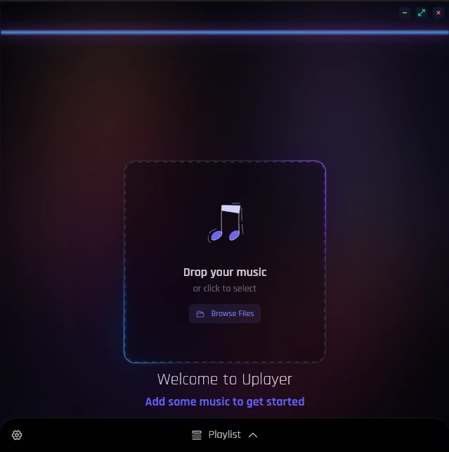
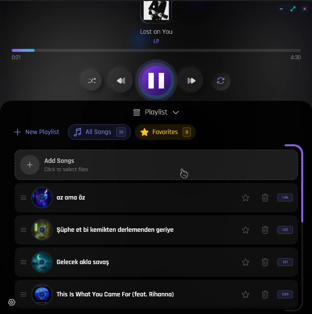
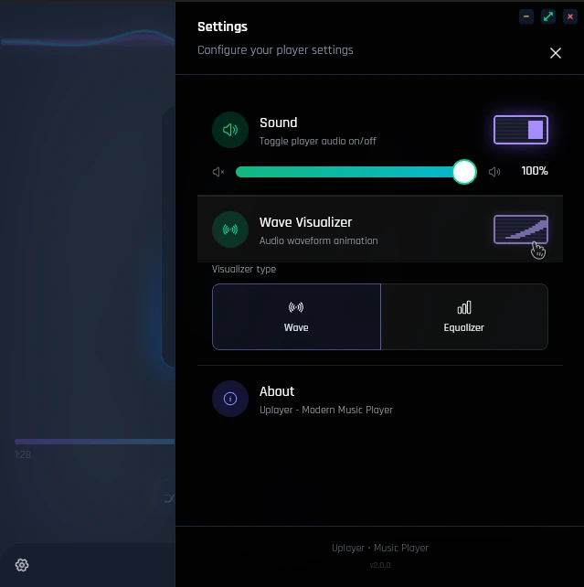

# 🎵 Uplayer

<div align="center">
  
  
  <h3>Modern Desktop Music Player</h3>
  
  <p>
    <strong>A beautiful, feature-rich music player built with Tauri + Nuxt 4 + Vue 3</strong>
  </p>

  <p>
    <a href="https://uplayer.emanet.in">🌐 Live Demo</a> •
    <a href="#features">Features</a> •
    <a href="#screenshots">Screenshots</a> •
    <a href="#installation">Installation</a> •
    <a href="#development">Development</a>
  </p>
</div>

---

## 📸 Screenshots

<div align="center">
  
  
  
  
</div>

---

## ✨ Features

- 🎵 **Local Music Playback** - Play music files from your computer
- 📁 **Folder Scanning** - Automatically discover music in folders
- 🎯 **File Association** - Right-click any audio file → Open with Uplayer
- 🪟 **Single Instance** - Opens files in existing window instead of new instance
- 🎬 **Now Playing** - Temporary playlist for externally opened files
- ❤️ **Favorites** - Mark your favorite songs
- 📋 **Playlist Management** - Create and manage custom playlists
- 🔀 **Shuffle & Repeat** - Multiple playback modes
- 🎨 **Audio Visualizer** - Beautiful equalizer and wave animations
- 📝 **Lyrics Support** - SBV subtitle format support
- 🖼️ **Cover Art** - Automatic extraction from audio metadata
- 🌙 **Dark Theme** - Modern, eye-friendly interface
- 🖥️ **Cross-Platform** - Linux, Windows, macOS support
- 🚫 **No Duplicates** - Prevents adding the same song twice

## 🛠️ Tech Stack

- **Frontend**: Nuxt 4, Vue 3, TailwindCSS 4
- **UI Components**: Nuxt UI 3
- **Desktop**: Tauri v2
- **Audio**: Web Audio API (VBR MP3 support)
- **Metadata**: Lofty (Rust), music-metadata-browser
- **Build**: Vite, pnpm

## 📦 Installation

### Download

Download the latest release for your platform:

| Platform | Download |
|----------|----------|
| Windows | `.exe` / `.msi` |
| Linux (Debian/Ubuntu) | `.deb` |
| Linux (Fedora/RHEL) | `.rpm` |
| macOS | `.dmg` |

### Requirements (for building)

- Node.js 20+
- pnpm 9+
- Rust 1.70+

## 🚀 Development

```bash
# Clone the repository
git clone https://github.com/yourusername/uplayer.git
cd uplayer

# Install dependencies
pnpm install

# Start development server (web only)
pnpm dev

# Start Tauri development (desktop app)
pnpm tauri dev

# Build for production
pnpm tauri build
```

## 📁 Project Structure

```
uplayer/
├── app/
│   ├── components/        # Vue components
│   ├── composables/       # Vue composables
│   ├── pages/            # Nuxt pages
│   └── assets/           # CSS and static files
├── public/               # Public assets
├── src-tauri/            # Tauri Rust backend
│   ├── src/             # Rust source code
│   ├── Cargo.toml       # Rust dependencies
│   └── tauri.conf.json  # Tauri configuration
├── nuxt.config.ts        # Nuxt configuration
└── package.json          # Node dependencies
```

## 🎵 Supported Formats

| Format | Extension |
|--------|-----------|
| MP3 | `.mp3` |
| WAV | `.wav` |
| FLAC | `.flac` |
| OGG Vorbis | `.ogg` |
| AAC | `.m4a`, `.aac` |
| Opus | `.opus` |

## 🎮 Usage

1. **Launch** - Open Uplayer
2. **Add Music** - Drag & drop files/folders or use the file browser
3. **Play** - Select a song from the playlist
4. **Organize** - Create playlists and add favorites
5. **External Files** - Right-click any audio file → Open with Uplayer

## 🔧 Configuration

Uplayer stores its data in:
- **Linux**: `~/.local/share/com.uplayer.app/`
- **Windows**: `%APPDATA%\com.uplayer.app\`
- **macOS**: `~/Library/Application Support/com.uplayer.app/`

## 📄 License

MIT License - feel free to use this project for any purpose.

---

<p align="center">
  Thank you god, made with ❤️ using <a href="https://tauri.app">Tauri</a> + <a href="https://nuxt.com">Nuxt</a>
</p>
